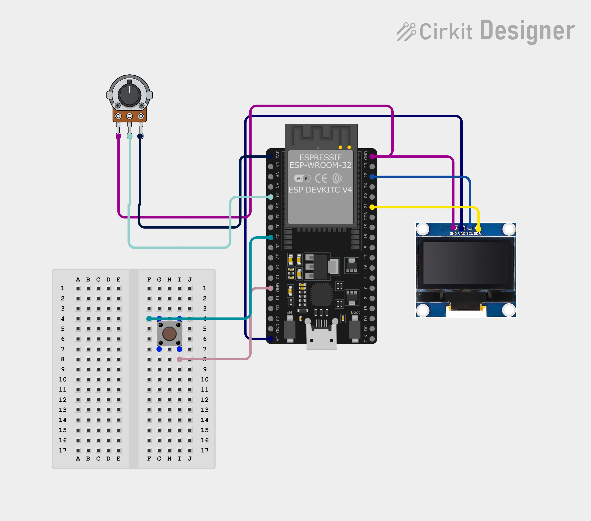

# LumiDesk

## Now Playing OLED Display

A small ESP32 + OLED display that mirrors whatever's currently playing on your PC — title, artist, album, a live animated progress bar, and time-synced lyrics — updated in near real time over your local network.
<p align="center">
  
  
  
</p>

## Table of Contents
 
1. [Project Overview](#project-overview)
2. [Motivation](#motivation)
3. [Workflow Overview](#workflow-overview)
4. [Tech Stack](#tech-stack)
5. [Key Features](#key-features)
6. [Architecture & Methods](#architecture--methods)
   - [Firmware Architecture](#firmware-architecture)
   - [Backend Architecture](#backend-architecture)
   - [Communication Protocol](#communication-protocol)
   - [Lyrics Sync](#lyrics-sync)
   - [Hardware Wiring](#Hardware-Wiring)
7. [Desktop Launcher](#desktop-launcher)
8. [Security](#security)
9. [Repo Structure](#repo-structure)
10. [Usage / Running the Project](#usage--running-the-project)
    - [Option A: Desktop Launcher](#option-a-desktop-launcher)
    - [Option B: Manual / From Source](#option-b-manual--from-source)
    - [Firmware Setup](#firmware-setup)
11. [Features Explained](#features-explained)
    - [Now Playing Display](#now-playing-display)
    - [Animated Progress Bar](#animated-progress-bar)
    - [Marquee Scrolling](#marquee-scrolling)
    - [Track-Change Notifications](#track-change-notifications)
    - [Synced Lyrics](#synced-lyrics)
12. [Future Enhancements](#future-enhancements)
13. [Key Learnings](#key-learnings)
14. [Installation Instructions](#installation-instructions)
15. [Limitations](#limitations)
---
 
## Project Overview
 
This project turns a cheap ESP32 + OLED into a dedicated "now playing" display for your PC. Instead of a phone lock screen or a browser tab, you get a small always-on screen showing exactly what's playing, how far into the track you are, and the current lyric line — no app switching required.
 
The interesting part is *how* it gets the track info: rather than authenticating against the Spotify Web API (OAuth flow, client IDs, token refresh, rate limits), it reads directly from Windows' built-in media session API. That means it works for Spotify, YouTube, browser tabs, or literally anything else that reports playback to Windows — with zero API keys involved.
 
## Motivation
 
- Phone/browser now-playing UIs are one more thing to glance at and unlock. A dedicated screen next to the keyboard is always visible, no interaction needed.
- Going through Spotify's official API means OAuth setup, token refresh handling, and being limited to Spotify specifically. Reading the OS media session sidesteps all of that and works with any player.
- It's also a good excuse to build something with a proper separation of concerns on the embedded side — instead of one big `.ino` file, the firmware is split into single-responsibility manager classes, which made it much easier to add lyrics and animations later without breaking the display logic.
## Workflow Overview
 
The system is two independent programs talking over local HTTP:
 
1. **Capture stage:** the Python backend polls the Windows `GlobalSystemMediaTransportControlsSessionManager` every 500ms for the current track, position, and playback state.
2. **Enrichment stage:** when the track changes, the backend fetches time-synced lyrics for it from LRCLIB and caches them.
3. **Serve stage:** FastAPI exposes the current song + current lyric line as JSON on `/spotify`.
4. **Display stage:** the ESP32 polls that endpoint, smooths the progress bar toward the real value, and hands the song state to the screen/animation/marquee/notification managers to render at ~30fps.
```
Windows Media Session → media_service.py → lyrics_service.py (LRCLIB)
                                 │
                                 ▼
                         FastAPI (/spotify)
                                 │
                          Wi-Fi (local network)
                                 │
                                 ▼
                    ESP32 (SpotifyClient → ScreenManager)
                                 │
                                 ▼
                        SH1106 OLED (128x64)
```
 
## Tech Stack
 
- **Firmware:** C++ (Arduino framework), ESP32
- **Backend:** Python 3, FastAPI, uvicorn
- **Media capture:** `winsdk` (Windows Runtime bindings for Python) — reads the OS-level "now playing" session
- **Lyrics:** [LRCLIB](https://lrclib.net) public API (synced lyrics, no auth required)
- **Display:** SH1106 OLED, 128x64, I2C
- **Desktop launcher:** `pystray` (system tray), `PyInstaller` (packages the whole thing into a single `.exe`)
- **Secondary tooling:** a small standalone C# console app (`spotify-media-helper/`) used to sanity-check the Windows media session independent of the Python backend
## Key Features
 
- Real-time track info (title, artist, album) pulled from whatever's actually playing on the PC — not limited to Spotify.
- Smoothly animated progress bar that eases toward the real playback position rather than snapping.
- Marquee scrolling for titles/artists too long to fit on a 128px-wide screen.
- Pop-up notification banner whenever the track changes.
- Time-synced lyrics, advancing in step with playback position.
- No OAuth setup or cloud accounts required — everything runs on the local network.
- Single-executable desktop launcher (`LumiDesk.exe`) — starts the backend, watches for crashes, and sits in the system tray with a settings window. No terminal required day-to-day.
- API key authentication between the ESP and backend — only your own device can pull song/weather data, even from others on the same network.
## Architecture & Methods
 
### Firmware Architecture
 
The `.ino` file is intentionally thin — it just wires together a set of manager classes, each responsible for one part of the display:
 
- **`SpotifyClient`** — connects to Wi-Fi, polls the backend's `/spotify` endpoint over plain HTTP, and parses the JSON response into a `SongInfo` struct.
- **`DisplayManager`** — low-level wrapper around the SH1106 driver; handles frame begin/end.
- **`ScreenManager`** — owns the current `SongInfo` state and decides what gets drawn each frame (player screen, connecting screen, etc.).
- **`AnimationManager`** — handles the eased progress bar and any transition animations.
- **`MarqueeManager`** — scrolls text horizontally when it's wider than the screen.
- **`NotificationManager`** — draws a temporary overlay banner (e.g. "Now Playing: <title>") that fades out after a track change.
The main loop runs at a fixed ~30fps (`FRAME_TIME = 33ms`), polling the backend independently of the render loop so the display stays smooth even if a network request is slow.
 
### Backend Architecture
 
- **`app.py`** — the FastAPI entrypoint. Starts a background thread running the media polling loop and exposes:
  - `GET /` — basic status
  - `GET /spotify` — current song JSON (title, artist, album, progress, duration, playing, current/next lyric line)
  - `GET /health` — lightweight health check
- **`media_service.py`** — the core polling loop. On every tick it asks Windows for the current media session, reads title/artist/album/position/duration/playback state, and — if the track changed — triggers a lyrics fetch.
- **`lyrics_service.py`** — queries LRCLIB for synced lyrics (`[mm:ss.xx]` formatted), parses them into a timestamp-indexed list, and exposes `current(progress_ms)` to look up the active + next line for a given playback position.
- **`models.py`** — the `SongInfo` dataclass shape used internally.
- **`routes/spotify.py`** — an alternate/legacy router-style endpoint for the same data, kept alongside the main `app.py` routes.
### Communication Protocol
 
Plain HTTP GET, JSON body. The ESP32 does its own minimal HTTP parsing (splitting host/port/path out of the configured server URL) rather than pulling in a heavier HTTP client library, to keep flash usage down.
 
Every request now carries an `X-API-Key` header, checked by a FastAPI middleware before any route runs — see [Security](#security) below for why and how it's set up.
 
### Lyrics Sync
 
Lyrics come from LRCLIB's public `/api/get` endpoint, matched by track + artist name — no API key required. The returned `syncedLyrics` block is parsed line-by-line into `{ time_ms, text }` pairs. On every backend tick, `lyrics_service.current(progress_ms)` walks that list to find the most recent line at-or-before the current playback position, plus whatever comes next — which is what gets serialized into `current_lyric` / `next_lyric` for the ESP32 to display.

## Hardware Wiring

LumiDesk runs on an ESP32 development board with a 0.96" SSD1306 OLED display. The project also supports a push button for screen interaction and a potentiometer for volume control.

### Components

- ESP32 DevKit V4 (ESP-WROOM-32)
- 0.96" SSD1306 OLED Display (I²C)
- 10kΩ Potentiometer (volume Control)
- Push Button
- Breadboard
- Jumper Wires
- USB Cable

---

## Pin Connections

### SSD1306 OLED Display

| OLED Pin | ESP32 Pin | Function |
|----------|-----------|----------|
| GND | GND | Ground |
| VCC | 3.3V | Power |
| SCL | GPIO22 | I²C Clock |
| SDA | GPIO21 | I²C Data |

---

### Potentiometer

| Potentiometer Pin | ESP32 Pin | Function |
|-------------------|-----------|----------|
| Left Pin | 3.3V | Power |
| Middle Pin | GPIO34 | Analog Input |
| Right Pin | GND | Ground |

---

### Push Button

| Button Pin | ESP32 Pin | Function |
|------------|-----------|----------|
| One Side | GPIO25 | Button Input |
| Other Side | GND | Ground |

---

## Complete Wiring

| ESP32 Pin | Connected To |
|-----------|--------------|
| 3.3V | OLED VCC, Potentiometer Left Pin |
| GND | OLED GND, Potentiometer Right Pin, Push Button |
| GPIO21 | OLED SDA |
| GPIO22 | OLED SCL |
| GPIO34 | Potentiometer Middle Pin |
| GPIO25 | Push Button |

---

## Circuit Diagram

<p align="center">
    
</p>

> Place the circuit image in `circuit_image.png`.

---

## Hardware Overview

- **OLED Display** — Displays Spotify playback, synced lyrics, weather, clock, notifications, and menus.
- **Potentiometer** — Adjusts display volume in real time.
- **Push Button** — Used for navigation and interaction.
- **ESP32** — Connects to Wi-Fi and communicates with the LumiDesk desktop application.

### Notes

- The OLED communicates using the I²C protocol.
- GPIO21 is used for SDA.
- GPIO22 is used for SCL.
- GPIO34 is configured as an analog input for the potentiometer.
- GPIO25 is configured as the push-button input.
- The ESP32 is powered through USB.
 
## Desktop Launcher
 
The backend used to mean opening a terminal, `cd`-ing into the folder, and running `python app.py` — leaving that window open the whole time. `LumiDesk.exe` replaces that with a double-click.
 
It's a thin controller sitting on top of the *same* `app.py`, unchanged — it doesn't touch the FastAPI routes, the media polling, or anything ESP-facing:
 
- **`bootstrap.py`** — the entrypoint. Loads config, sets up logging, starts the backend, waits for `/health`, hands off to the tray.
- **`config.py`** — one `config.json` (in `%APPDATA%/LumiDesk/`) instead of scattered `.env` edits. Also generates the API key on first run (see [Security](#security)) and writes the `.env` the backend already reads via `load_dotenv()`.
- **`backend_manager.py`** — runs `uvicorn app:app` as a managed subprocess: health-checks it, restarts it a few times with backoff if it crashes, and stops trying if it keeps crashing immediately (so a real bug shows up in the log instead of looping forever).
- **`ip_watcher.py`** — watches your PC's local IP and logs a warning if it changes, since the ESP's `SERVER_URL` is baked in at flash time and can't be pushed a new address at runtime.
- **`tray.py`** — the actual UI: a system tray icon with Start/Stop/Restart backend, open settings, open logs, copy the API key, and quit.
- **`settings_window.py`** — a small window (weather lat/lon, backend port) that writes back into `config.json`.
- **`logging_setup.py`** — rotating log file, since a windowed exe has no console to print to.
- **`lumidesk_flat.spec`** — the PyInstaller build spec.
Building it yourself:
```bash
pip install pyinstaller
pyinstaller lumidesk_flat.spec
```
Output lands in `dist/LumiDesk.exe` (not committed to this repo — see the note on that in the project history / discussions).
 
What it deliberately does **not** do: no USB Wi-Fi provisioning for the ESP (firmware still takes `WIFI_SSID`/`WIFI_PASSWORD` via `secrets.h` at flash time — there's no serial listener to receive them at runtime), and no "launch a Spotify helper" step (`media_service.py` already reads the Windows media session directly; `spotify-media-helper/` is a standalone debug tool, not something the running app depends on).
 
## Security
 
The ESP has to reach the backend over the network, which means binding to `0.0.0.0` — and network-level restrictions alone can't tell "your ESP" apart from another device on the same Wi-Fi. So there's a shared secret instead:
 
- On first run, `config.py` generates a random 64-character API key and stores it in `config.json`.
- `app.py` checks every incoming request for an `X-API-Key` header matching that key (`require_api_key` middleware) — no match, no data, `401`.
- The ESP firmware sends that header on every request (`SpotifyClient.cpp`, `WeatherManager.cpp`, and the volume-post in `main.ino`), reading it from `secrets.h` as `ENV_API_KEY`.
- Get the key via the tray: right-click → **Copy API key (for ESP setup)** — it's copied straight to your clipboard, never printed to any log file.
If `API_KEY` isn't set in the environment (e.g. running `python app.py` directly without the launcher), auth is skipped rather than locking you out — don't rely on that as your only protection if you do run it that way.
 
## Repo Structure
 
```
LumiDesk/
├── main.ino                  # Firmware entrypoint, wires up all managers
├── SpotifyClient.h/.cpp       # Polls backend, parses song JSON, sends API key header
├── DisplayManager.h/.cpp      # OLED driver wrapper
├── ScreenManager.h/.cpp       # Decides what's on screen
├── AnimationManager.h/.cpp    # Progress bar easing / transitions
├── MarqueeManager.h/.cpp      # Scrolling text for long titles
├── NotificationManager.h/.cpp # Track-change popup banner
├── WeatherManager.h/.cpp      # Fetches weather from backend, sends API key header
├── ClockManager.h/.cpp        # Local clock display
├── IdleManager.h/.cpp         # Idle-screen state
├── UIModels.h                 # Shared structs + the API_KEY extern
├── app.py                     # FastAPI entrypoint + API key middleware
├── media_service.py           # Windows media session polling loop
├── lyrics_service.py          # LRCLIB fetch + lyric-line lookup
├── models.py                  # SongInfo dataclass (backend side)
├── cache.py                   # Lyrics cache
├── providers.py               # Lyrics provider integrations
├── test_media.py              # Standalone script to sanity-check media capture
├── routes/
│   └── spotify.py             # Alternate router-based endpoint
├── spotify-media-helper/       # Standalone C# console app for testing media capture
├── bootstrap.py                # Desktop launcher entrypoint
├── config.py                   # config.json manager, API key generation, .env writer
├── backend_manager.py           # Runs/watches the backend subprocess
├── ip_watcher.py                # Local IP detection + change warnings
├── tray.py                      # System tray icon and menu
├── settings_window.py           # Small settings popup (weather, port)
├── logging_setup.py             # Rotating log file setup
├── lumidesk_flat.spec            # PyInstaller build spec
└── requirements.txt
```
 
## Usage / Running the Project
 
### Option A: Desktop Launcher
 
```bash
pip install -r requirements.txt
python bootstrap.py
```
 
This loads `config.json` (created with defaults on first run), starts the backend hidden in the background, waits for it to be healthy, and puts an icon in your system tray. Right-click it to open settings (weather lat/lon, port), see status, or grab the API key for the ESP.
 
To get an actual double-click `.exe` instead of running from source:
```bash
pip install pyinstaller
pyinstaller lumidesk_flat.spec
```
`dist/LumiDesk.exe` is the result — copy it wherever you like, make a shortcut, done.
 
### Option B: Manual / From Source
 
```bash
pip install -r requirements.txt
python -m uvicorn app:app --host 0.0.0.0 --port 8000
```
 
Find your PC's local IP address (`ipconfig` on Windows) — you'll need it for the firmware config either way.
 
### Firmware Setup
 
1. Open `main.ino` in the Arduino IDE.
2. In `secrets.h` (gitignored — create it locally, it's never committed), set:
```cpp
   #define ENV_WIFI_SSID "your_wifi_name"
   #define ENV_WIFI_PASSWORD "your_wifi_password"
   #define ENV_API_KEY "the key from LumiDesk's tray menu"
```
3. Point `SERVER_URL` at your PC's local IP:
```cpp
   const char* SERVER_URL = "http://192.168.x.x:8000/spotify";
```
4. Flash to the ESP32.
### Running It
 
With the backend running and the ESP32 flashed and connected to Wi-Fi, the display should show "Connecting..." briefly, then start showing whatever's actively playing on the PC — updating within about half a second of any change.
 
## Features Explained
 
### Now Playing Display
 
The core screen shows title, artist, and album, refreshed every backend poll cycle (500ms). This is driven entirely by `ScreenManager`, which holds the latest `SongInfo` and re-renders it every frame.
 
### Animated Progress Bar
 
Rather than snapping straight to the real playback position (which would look jittery given the 500ms poll interval), `AnimationManager` eases the displayed progress toward the target value each frame:
```cpp
song.animatedProgress += (targetProgress - song.animatedProgress) * 0.15f;
```
This gives a smooth, continuously-moving bar even though the underlying data only updates twice a second.
 
### Marquee Scrolling
 
Long titles or artist names that don't fit the 128px-wide screen are scrolled horizontally by `MarqueeManager` rather than truncated, so nothing gets cut off.
 
### Track-Change Notifications
 
Whenever `SpotifyClient` detects the title has changed since the last poll, `NotificationManager` draws a temporary "Now Playing" banner over the current screen, which fades after a few seconds.
 
### Synced Lyrics
 
When lyrics are available for the current track, the current and next line are shown alongside the track info, advancing automatically as `lyrics_service.current()` reruns against the live playback position on the backend.
 
## Future Enhancements
 
- Cross-platform media capture (macOS/Linux equivalents to `winsdk`), since the backend is currently Windows-only.
- Album art rendering — dithered to 1-bit for the OLED.
- Multiple display "pages" (e.g. a dedicated lyrics-only view, a queue view).
- WebSocket push from the backend instead of polling, to cut latency below the current ~500ms.
- Optional direct Spotify Web API mode as a fallback for setups without a Windows PC in the loop.
## Key Learnings
 
- Reading the OS-level media session is a much lower-friction way to get "now playing" data than integrating a music service's official API — at the cost of being tied to that OS.
- Splitting embedded firmware into single-responsibility manager classes (display, screen, animation, marquee, notifications) made it far easier to extend than one monolithic loop.
- Easing/interpolating a low-frequency network value (progress polled at 500ms) into a smooth 30fps animation is a small trick that makes a big visual difference.
- Keeping the ESP32's HTTP handling manual and minimal (rather than pulling in a full HTTP client library) keeps flash usage low on a memory-constrained device.
## Installation Instructions
 
```bash
# 1. Clone the repository
git clone https://github.com/Aravkataria/LumiDesk.git
cd LumiDesk
 
# 2. Set up the backend environment
python -m venv venv
venv\Scripts\activate        # Windows
pip install -r requirements.txt
 
# 3a. Run it via the desktop launcher (tray icon, no terminal left open)
python bootstrap.py
# ...or build LumiDesk.exe:
#   pip install pyinstaller && pyinstaller lumidesk_flat.spec
 
# 3b. ...or run the backend directly instead
uvicorn app:app --host 0.0.0.0 --port 8000 --reload
 
# 4. Add secrets.h (gitignored, not included) with your Wi-Fi
#    credentials and the API key from the tray's "Copy API key" option,
#    then flash main.ino to the ESP32 via the Arduino IDE
```
 
## Limitations
 
- Windows-only for now — media capture relies on `winsdk`, which is a Windows Runtime binding.
- Backend and ESP32 must be on the same local network; there's no remote/cloud relay.
- Lyrics availability depends entirely on LRCLIB's database — not every track will have synced lyrics.
- API key auth keeps other devices on your network from reading `/spotify` or `/weather`, but it doesn't hide that the port is open — someone could still see a service is listening there, just not get data back without the key.
- If the backend's local IP changes (new router, DHCP lease expiry), the ESP won't know — `SERVER_URL` is baked in at flash time, so that means a DHCP reservation or a re-flash, not something the desktop launcher can fix on its own.
- `LumiDesk.exe` isn't distributed through this repo — build it yourself with `pyinstaller lumidesk_flat.spec` (see [Desktop Launcher](#desktop-launcher)). A compiled binary doesn't belong in git history, and it'd need to be rebuilt per-machine anyway since PyInstaller bakes in Windows/Python-version-specific bits.
 
